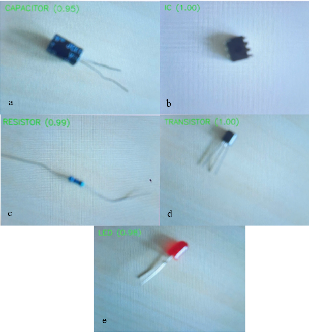

# Electronic Component Recognition (MobileNetV2)

## Description

This project focuses on recognizing electronic components using a CNN model (MobileNetV2).
The system can classify components such as resistor, capacitor, IC, transistor, and LED from camera input.

The model is lightweight and designed to run on edge devices like Raspberry Pi.


## What I did

* Collected and prepared a dataset of electronic components
* Applied preprocessing and data augmentation
* Used transfer learning with MobileNetV2
* Trained the model using Google Colab (GPU support)
* Built a real-time recognition system using OpenCV
* Deployed the model on Raspberry Pi for real-time inference


## Results

* Accuracy: around 85–90% (estimated)
* Works in real-time conditions
* Runs on Raspberry Pi with acceptable performance
* May give wrong predictions under poor lighting or complex background


## Demo

### Image (demo_results.png)



### Video (real_time_recognition_demo.mp4)

real_time_recognition_demo.mp4


## How to run

### 1. Create virtual environment

```bash
python -m venv venv

Activate:

* Windows:

```bash
venv\Scripts\activate

* Linux / macOS:

```bash
source venv/bin/activate
```


### 2. Install libraries

```bash
pip install -r requirements.txt


### 3. Run the system

```bash
python run_raspberrypi.py


## Requirements

tensorflow
opencv-python
numpy


## Files

Mobilenetv2.py
run_raspberrypi.py
demo_results.png
real_time_recognition_demo.mp4
README.md


## Notes

* This project uses image classification (not object detection)
* It predicts the main component in the frame
* Can be improved by using YOLO for multi-object detection
* Performance on Raspberry Pi depends on model size and input resolution
* The model may struggle with overlapping objects or complex backgrounds


## Author

* Nguyễn Quốc An
* Engineering Physics Student at Can Tho University
